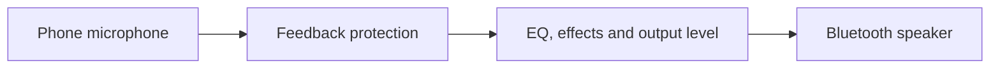

<div align="center">

# Phone Mic

### Your phone. Your voice. Your speaker.

Turn your Android phone into a live microphone for a Bluetooth speaker.<br>
Connect, choose your sound, and start speaking.

[](#get-started)
[](https://github.com/ridhwansalim/Phone-Mic/releases/tag/v1.4)
[](#before-you-use-it)
[](#privacy--permissions)

**[Download APK](https://github.com/ridhwansalim/Phone-Mic/releases/download/v1.4/PhoneMic-v1.4-debug.apk)** &nbsp; · &nbsp; **[All releases](https://github.com/ridhwansalim/Phone-Mic/releases)** &nbsp; · &nbsp; **[Report an issue](https://github.com/ridhwansalim/Phone-Mic/issues)**

Designed and built by **[Ridhwan S.](https://github.com/ridhwansalim)**

</div>

---

## A microphone, using what you already have

Phone Mic sends audio from your phone’s **built-in microphone** to a connected Bluetooth media speaker. The Home screen keeps the essentials within reach: your speaker, microphone controls, input meter and output volume. Open the settings gear when you want to shape your sound.

No account. No audio uploads. No calibration step.

## What you can do

- **Go live with a tap.** Select your connected speaker and start or stop microphone playback from Home.
- **Shape your voice.** Adjust a five-band equalizer, bass boost and creative echo, or use the vocal preset as a starting point.
- **Control your output.** Set the app’s output level and use your phone’s volume keys for media volume.
- **Use hold-to-talk.** Keep the mic muted between phrases; releasing the button or leaving the app mutes software output.
- **Reduce feedback risk.** Enable rumble filtering, a noise gate and automatic output reduction when a sustained feedback tone is detected.
- **Keep controls nearby.** Stop from the foreground notification, receive disconnect alerts, and optionally resume after temporary audio interruptions when Android returns audio focus.

Settings are saved between sessions. Audio is processed locally on your phone.

## Get started

You need an **Android 8.0 or newer phone** and a **Bluetooth speaker connected for media audio**.

1. **[Download the v1.4 APK](https://github.com/ridhwansalim/Phone-Mic/releases/download/v1.4/PhoneMic-v1.4-debug.apk)** and open it on your phone. If Android asks, allow installation from the browser or file manager you used.
2. **Pair your speaker** in Android Bluetooth settings. The app’s **Pair** shortcut takes you there.
3. **Select the speaker** in Phone Mic and tap **Start microphone**. Allow microphone and nearby-device access when prompted; allow notifications for background controls.
4. **Start at low volume.** Speak close to the phone and point the speaker away from its microphone.
5. **Fine-tune in Settings.** Try the vocal preset, adjust your output level, or enable hold-to-talk. Stop the mic before switching speakers.

The download is **v1.4, build 9**, a debug-signed pre-release. It can update the earlier v1.4 build 8 without uninstalling. [Checksums](dist/SHA256SUMS.txt) are available for every archived APK.

## Before you use it

**Bluetooth introduces a delay.** The amount depends on the phone, speaker and audio route. Phone Mic does not provide zero-latency monitoring or replace a dedicated wireless microphone for timing-sensitive performances.

**A nearby speaker can still feed back.** Keep echo effects off for clear speech, start with low output, and leave space between the phone and speaker. Feedback protection reduces risk; it cannot guarantee complete cancellation. If you hear howling, stop playback and lower the speaker volume.

**Device behavior varies.** Android decides which Bluetooth outputs are available to the app. Background playback, notification behavior and call recovery can differ across devices. Audio already buffered by Bluetooth may play briefly after software mute.

## Privacy & permissions

Phone Mic does not request internet access, save audio recordings or upload microphone audio. Creator profile links open externally in your browser or another app.

- **Microphone:** captures the voice you want to amplify.
- **Nearby devices:** accesses connected Bluetooth devices on supported Android versions.
- **Notifications:** provides playback controls and interruption alerts.
- **Foreground service and wake lock:** support an active microphone session while the screen is off.

## What changed in v1.4?

The interface now has a compact Home screen, a settings gear, and a creator profile modal accessible from the footer.

The experimental speaker-calibration feature was removed after repeated unsuccessful device tests. Microphone playback now starts directly after permission and routing checks. EQ, voice effects, feedback protection and hold-to-talk remain available.

[Read the v1.4 notes](docs/UI_AND_CALIBRATION_1.4.md) · [Explore the version history](docs/VERSIONS.md)

<details>
<summary><strong>Looking for an older version?</strong></summary>

Eight APK versions, from v1.0 through v1.4, are preserved in [GitHub Releases](https://github.com/ridhwansalim/Phone-Mic/releases) and the [dist directory](dist). Older releases may contain features that were later removed.

Historical `archive/` tags preserve APKs; they do not contain the original source snapshots for those old builds. The repository’s source history begins with the v1.3.1 import. Downgrading may require uninstalling the app, which clears its settings.

</details>

## Build from source

The app uses **native Android views and Java**, with no web runtime.

Requirements: **JDK 17**, **Android SDK 35**, and an Android Studio installation or configured SDK path. The included wrapper uses Gradle 8.11.1 with Android Gradle Plugin 8.9.2. The current app does not require NDK or CMake.

```bash
git clone https://github.com/ridhwansalim/Phone-Mic.git
cd Phone-Mic
```

Open the project in Android Studio and let Gradle sync, or set `ANDROID_HOME` to your SDK location and build from the terminal:

```bash
# macOS / Linux
./gradlew assembleDebug lintDebug
```

```powershell
# Windows
.\gradlew.bat assembleDebug lintDebug
```

The APK is generated at `app/build/outputs/apk/debug/app-debug.apk`.

<details>
<summary><strong>Development scripts and validation</strong></summary>

[tools/build.ps1](tools/build.ps1) supports the maintainer’s workspace-local toolchain under `.tooling/`. It runs the standalone DSP and session-state tests, builds the APK, optionally runs lint with `-Lint`, and copies the result into `dist`. That ignored toolchain is not included in a fresh clone; use Android Studio or the Gradle wrapper for a standard setup.

The [tests](tests) cover EQ, bass, echo timing, mute, feedback protection, hold-to-talk and interruption/Stop behavior. Build, lint and those tests passed for v1.4 build 9. They do not replace physical-device testing: audio quality, call recovery, notifications and longer sessions need checks on real hardware. See the [device test checklist](docs/DEVICE_TESTS.md).

The retired cancellation implementation, its tests and third-party notices are preserved in [experiments/speaker-echo](experiments/speaker-echo/README.md). They are excluded from the current Android app.

</details>

## How the audio flows



`MainActivity` handles the interface and saved settings. `MicService` owns microphone capture, playback, audio focus, notifications and route monitoring. `AudioProcessor` shapes the audio; `SessionState` manages interruption and resume behavior. The selected Bluetooth route is checked before capture and throughout playback.

## Feedback & contributions

Found a bug or have an idea? [Open an issue](https://github.com/ridhwansalim/Phone-Mic/issues) with your phone model, Android version, speaker model, app version and steps to reproduce it. For audio problems, include your volume/effect settings and whether the issue happens with hold-to-talk enabled.

Bug fixes, clearer documentation and device-test results are welcome. For a substantial feature, start with an issue so its behavior and scope can be discussed first.

---

<div align="center">

### Meet the creator


**Ridhwan S.**<br>
Designed and built Phone Mic.

[GitHub](https://github.com/ridhwansalim) &nbsp; · &nbsp; [Instagram](https://www.instagram.com/ridhwan_salim/) &nbsp; · &nbsp; [LinkedIn](https://www.linkedin.com/in/ridhwan-s/)

</div>
